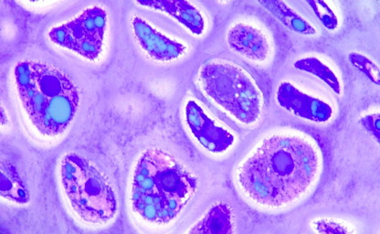
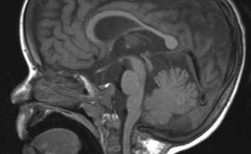
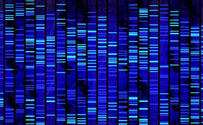
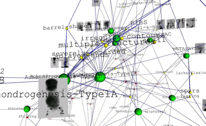

Skeletal dysplasias are rare genetic disorders affecting development and function of the skeleton. Over 400 different skeletal dysplasias are currently recognised. Every aspect of skeletal development can be affected, resulting in a wide variety of symptoms. Bones can fail to form, fail to grow, or be structurally abnormal, resulting in skeletal deformities and fractures.

Typical features of skeletal dysplasias are short stature, early onset arthritis or increased bone fragility.  As the skeleton forms a scaffold around many vital organs, secondary complications, such as breathing difficulties due to an underdeveloped rib cage or neurological damage due to compression of the spinal cord can develop.  

While worthy of our attention in their own right, skeletal dysplasias also serve as models for more common musculoskeletal conditions, such as osteoporosis and osteoarthritis. Skeletal dysplasias allow us to the study the effect of changes in single genes on skeletal development. A lot of our understanding of skeletal biology and the pathogenetic mechanisms that lead to osteoarthritis and osteoporosis has come from studying the genetic defects and altered pathophysiology in patients with these rare disorders.

# Areas of Research

	

			
			<h3>Clinical Research</h3>
			
We study the clinical and radiographic characteristics of skeletal dysplasias, establish genotype-phenotype correlations, evaluate new treatments and perform clinical trials.

 	

		

			
			<h3>Molecular Genetics and Genomics</h3>
			
We apply Whole Genome Sequencing and other high-throughput -omics technologies to identify genetic variants and novel genes involved in skeletal dysplasias and study their role in bone and cartilage biology.

		
		
	

				
				<h3>Bioinformatics</h3>
				
We integrate clinical, genetic and molecular data to obtain a systems level view of skeletal biology. A particular focus is Phenomics, the computational processing of clinical (phenotype) data.

	

### We can accommodate students with medical, science or computational backgrounds interested in obtaining an Honours, Masters or PhD degree. Please [contact us](mailto:andreas.zankl@sydney.edu.au).

<!--  

# Projects (use Posts)

GrowthShare
Palovarotene
MCTO
OHMR
Bone Dysplasia Ontology
Biolark-CR/Patient Archive
Textmining EMR

-->

