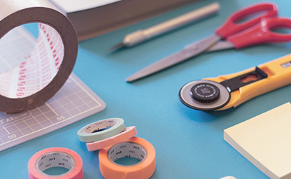

<!-- Section -->
<section>
	<header class="major">
		<h2>Find Out More</h2>
	</header>
	

		<article>
			
			

				<h3>What Are Skeletal Dysplasias?</h3>
				
There are over 400 types of skeletal dysplasias. Find out more about these rare disorders, their causes, their clinical features, their treatment. 

			

		</article>
		<article>
			
			

				<h3>Diagnosis</h3>
				
Correct diagnosis is the first step to the right treatment. Find out how we can assist families and doctors in making the right diagnosis.

			

		</article>
		<article>
			
			

				<h3>Clinical Care</h3>
				
Skeletal dysplasias require specialised care. Find out more about our multidisciplinary management service for skeletal dysplasias.

			

		</article>
		<article>
			
			

				<h3>Research</h3>
				
What causes skeletal dysplasias? Find out how we study skeletal dysplasias with clinical, molecular and computational methods.

			

		</article>
	

</section>

<!-- Section -->
<section>
	<header class="major">
		<h2>Ipsum sed dolor</h2>
	</header>
	

		<article>
			
			<h3>Interdum aenean</h3>
			
Aenean ornare velit lacus, ac varius enim lorem ullamcorper dolore. Proin aliquam facilisis ante interdum. Sed nulla amet lorem feugiat tempus aliquam.

			<ul class="actions">
				<li><a href="#" class="button">More</a></li>
			</ul>
		</article>
		<article>
			
			<h3>Nulla amet dolore</h3>
			
Aenean ornare velit lacus, ac varius enim lorem ullamcorper dolore. Proin aliquam facilisis ante interdum. Sed nulla amet lorem feugiat tempus aliquam.

			<ul class="actions">
				<li><a href="#" class="button">More</a></li>
			</ul>
		</article>
		<article>
			
			<h3>Tempus ullamcorper</h3>
			
Aenean ornare velit lacus, ac varius enim lorem ullamcorper dolore. Proin aliquam facilisis ante interdum. Sed nulla amet lorem feugiat tempus aliquam.

			<ul class="actions">
				<li><a href="#" class="button">More</a></li>
			</ul>
		</article>
		<article>
			
			<h3>Sed etiam facilis</h3>
			
Aenean ornare velit lacus, ac varius enim lorem ullamcorper dolore. Proin aliquam facilisis ante interdum. Sed nulla amet lorem feugiat tempus aliquam.

			<ul class="actions">
				<li><a href="#" class="button">More</a></li>
			</ul>
		</article>
		<article>
			
			<h3>Feugiat lorem aenean</h3>
			
Aenean ornare velit lacus, ac varius enim lorem ullamcorper dolore. Proin aliquam facilisis ante interdum. Sed nulla amet lorem feugiat tempus aliquam.

			<ul class="actions">
				<li><a href="#" class="button">More</a></li>
			</ul>
		</article>
		<article>
			
			<h3>Amet varius aliquam</h3>
			
Aenean ornare velit lacus, ac varius enim lorem ullamcorper dolore. Proin aliquam facilisis ante interdum. Sed nulla amet lorem feugiat tempus aliquam.

			<ul class="actions">
				<li><a href="#" class="button">More</a></li>
			</ul>
		</article>
	

</section>
